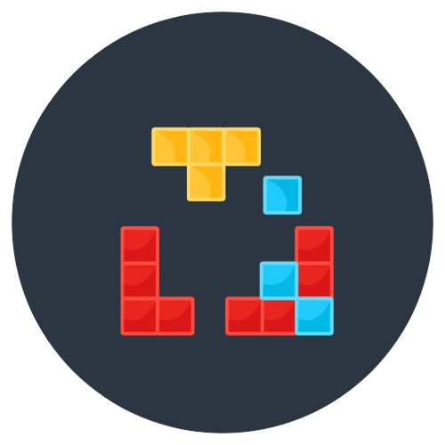

#  Casse-Briques - Un remake

Ce projet consiste à faire un remake du jeu classique de casse-briques, il sera développé en C++ avec l'utilisation de la bibliothèque SDL2 pour l'affichage.

## Fonctionnalités

- [x] Plateforme déplaçable au clavier ou à la souris.
- [x] Balle rebondissant en fonction de son angle d'impact.
- [x] Briques de différents types avec différentes résistances.
- [x] Bonus/malus, y compris le multi-balle.
- [x] Grilles chargées depuis un fichier ASCII.

## Fonctionnement du jeu

### - Objectif
Le but du jeu est de détruire toutes les briques présentes sur l'écran en rebondissant une balle avec une plateforme mobile.

### - Contrôles
Vous pouvez utiliser les touches fléchées gauche et droite pour déplacer la plateforme.

### - Mécaniques de jeu
*1. Plateforme :* La plateforme est contrôlée par le joueur et sert à renvoyer la balle. Si la balle tombe en dessous de la plateforme, le joueur perd des points (-5 sur son score).

*2. Balle :* La balle rebondit sur les murs et les briques. Si elle touche une brique, la brique perd de la résistance. Si la résistance d'une brique atteint 0, elle est détruite. Lorsque la balle touche une brique, le joueur gagne des points(+1 sur son score) et si le joueur détruit une brique, il gagne 5 points sur score. Si toutes les balles sont détruites, le joueur perd une vie.

*3. Briques :* Il existe différents types de briques avec des résistances différentes. Certaines briques peuvent contenir des bonus ou des malus, ou une balle. Les briques peuvent avoir 3 formes (rectangles, triangles ou hexagones).

*4. Score :* Le score augmente à chaque fois qu'une brique est détruite (+5), ou à chaque fois que l'on touche à une brique avec la balle (+1). Si la balle tombe en dessous de la plateforme, on perd 5 points.

*5. Vies :* Le joueur commence avec un nombre de vies défini (3 vies). Une vie est perdue quand le joueur perd toutes les balles et une nouvelle bale est remis. Lorsque la vie arrive à 0, le joueur perd la partie.

*6. Bonus et Malus :* 
Notre propose un système de bonus et de malus qui peuvent être obtenus en détruisant des briques spécifiques et en récuperant ces bonus et malus à l'aide de la plateforme mobile. Les bonus sont répresentent par la couleur blanche et les malus par la couleur rouge.

*Bonus :* 

- Agrandissement de la plateforme : Augmente la taille de la plateforme. Il y a toutefois une limite de la longeur de la plateforme maximale (300).

- Vie supplémentaire : Ajoute une vie supplémentaire au joueur.Il y a un nombre de vie max à obtenir pendant une partie (6).

*Malus :*

- Réduction de la taille de la plateforme : Diminue la taille de la plateforme. Il y a toutefois une limite de la longeur de la plateforme minimale (50).
- Perte de vie : Fait perdre une vie au joueur.

Les limites pour les bonus et les malus peuvent être modifiés.

*Multi-Balle*
Le jeu génére des balles supplémentaires. Ces balles supplémentaires peuvent être obtenues en détruisant des briques spéciales.

Pour l'apparition de bonus/malus et de la multi-balle dans une brique, il y a une certaine probabilité pour qu'ils soient contenus dans les briques. Si une brique contient une multi-balle, elle ne pourra pas contenir d'autres bonus/malus.

### - Nouveautés depuis la présentation 

*1. Ajout des bonus/malus* 
*2. Ajout d'un système de vie*
*3. Amélioration du système de score*

## Compilation et exécution

1. Il faut avoir installé SDL2 sur votre machine.
2. Après, il faut ce dépôt sur votre machine.
3. Ensuite, il faut générez le projet avec CMake et le compiler avec make:

```bash
mkdir build
cd build
cmake ..
make
```

4. Exécutez le jeu :

Pour exécuter le jeu, on peut charger un fichier contenant les grilles en ASCII, en premier ligne du fichier on défini le type de brique et on utilise les caractères suivants pour définir le type de résistance (#,+,*).
Soit on peut choisir un type de brique et les briques seront construites avec des résistance aléatoires.


Pour charger un fichier de grille en ASCII:
```bash
./CasseBrique tests/test1.txt
```

Pour générer des grilles aléatoires avec différents types de briques:
```bash
./CasseBrique rectangle 
./CasseBrique triangle 
./CasseBrique hexagon 
```

## Auteur

Nicolas MARRA
Eddine NASRI

## Licence

Ce projet est sous [licence](LICENSE).